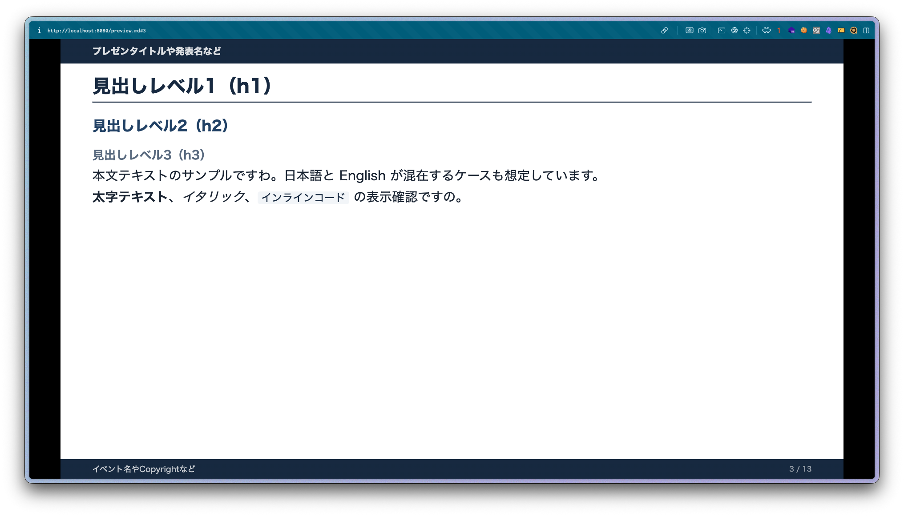
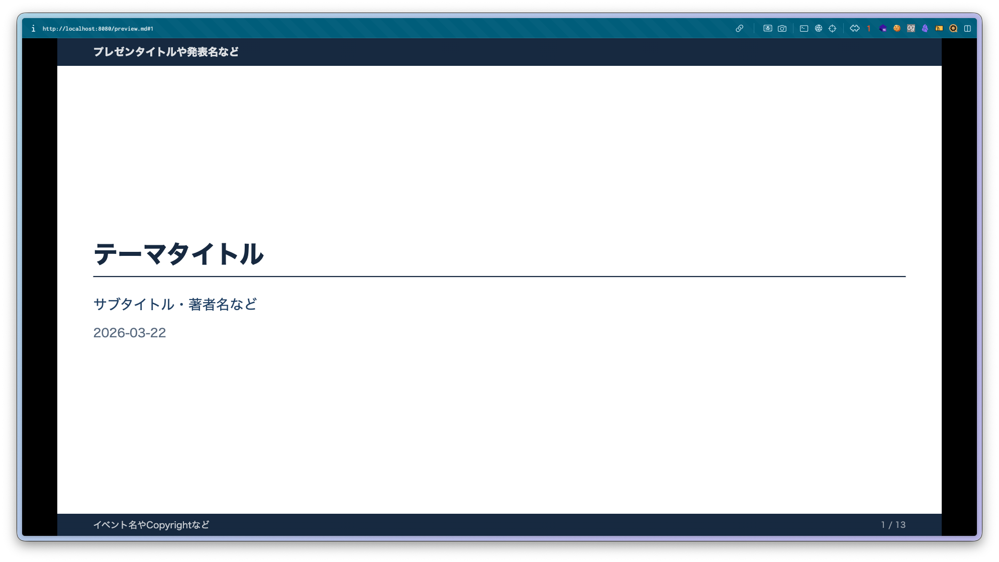
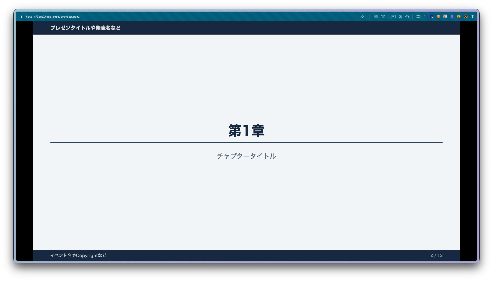

# ruri（瑠璃）— Marp カスタムテーマ

白基調・上下紺バーのシンプルな Marp テーマです。

## ファイル構成

```
./
├── ruri.css        # テーマ本体
├── preview.md      # デザイン確認用スライド
├── README.md       # このファイル
└── img/
```

---

## 基本的な使い方

### frontmatter

```yaml
---
marp: true
theme: ruri
paginate: true
header: 'プレゼンタイトルや発表名など'
footer: 'イベント名やCopyrightなど'
---
```

### ビルドコマンド

```bash
marp --theme ruri.css slides.md
```

---

## スライドのレイアウト

```
┌─ header テキスト（白・任意） ──────────────┐ ← 紺バー
│ h1 見出しテキスト（紺）                    │
│ ─────────────────────────────────────────  │
│                                            │
│  本文エリア（左上揃え）         [ロゴ]     │
│                                            │
├─ footer テキスト（白・任意） ── 1 / 10 ───┘ ← 紺バー
```


---

## スライドクラス

スライドの先頭に `<!-- _class: クラス名 -->` を記述します。

### `title`（表紙スライド）




```markdown
<!-- _class: title -->

# 論文タイトル
## 著者名
### 2026-03-22
```

- ロゴ・ページ番号は非表示
- h1 は通常フローで大きく表示

### `lead`（章区切りスライド）



```markdown
<!-- _class: lead -->

# 第1章
## チャプタータイトル
```

- ロゴ・ページ番号は非表示
- h1 は中央揃えで大きく表示
- 背景がわずかにグレー

---

## ロゴの設定

デフォルトはロゴなし。`style` キーで画像パスとサイズを指定します。

```yaml
---
marp: true
theme: ruri
style: |
  :root {
    --logo-url:  url('./img/your-logo.png');
    --logo-size: 80px;
  }
---
```

ロゴはスライド右下（下バーの上）に表示されます。`title` / `lead` クラスでは非表示になります。

---

## 要素のセンタリング

### スライド全体を中央揃え

`_class` に `center` / `right` / `middle` を追加します（他のクラスと併用可）。

```markdown
<!-- _class: center -->

ここのテキストは中央揃えになります。

---

<!-- _class: title center -->

# 中央揃えのタイトルスライド
```

| クラス | 効果 |
|---|---|
| `center` | テキストを水平中央揃え |
| `right` | テキストを右揃え |
| `middle` | コンテンツを縦方向中央揃え |

### 特定の要素だけ中央揃え

`--html` オプションを有効にすると `<div>` タグが使えます。

```bash
marp --html --theme ruri.css slides.md
```

```markdown
通常のテキストは左揃えです。

<div class="center">

この段落だけ中央揃えです。

</div>

また左揃えに戻ります。
```

---

## 2カラムレイアウト

`--html` オプションを有効にした上で、CSS Grid を使って2カラムレイアウトを作成できます。

```markdown
<div style="display: grid; grid-template-columns: 1fr 1fr; gap: 2em;">

<div>

### 左カラム

- ポイントA
- ポイントB

</div>

<div>

### 右カラム

| 項目 | 値 |
|---|---|
| 精度 | 89% |

</div>
</div>
```

---

## 引用ブロック

```markdown
> 引用テキストをここに書きます。
```

左端に紺色のボーダーが付き、グレー背景でスタイリングされます。

---

## 数式（KaTeX）

Marp はデフォルトで KaTeX による数式レンダリングをサポートしています。

### インライン数式

```markdown
式は $E = mc^2$ のように書きます。
```

### ディスプレイ数式

```markdown
$$
\hat{y} = \sigma(Wx + b)
$$
```

ディスプレイ数式は自動的に中央揃えになります。

---

## 画像とキャプション

画像の直後の段落をイタリック（`*...*`）にすると、自動的にキャプションとしてスタイリングされます。

```markdown


*Figure 1: キャプションテキスト*
```

- 小さめのグレー文字で中央揃えになります

---

## カスタマイズ可能な CSS 変数

`style` キーで `:root` の変数を上書きすることで各種調整ができます。

| 変数 | デフォルト値 | 説明 |
|---|---|---|
| `--color-navy` | `#1a2e4a` | 上下バー・見出しの紺色 |
| `--header-bar-height` | `40px` | 上バーの高さ |
| `--bottom-bar-height` | `32px` | 下バーの高さ |
| `--pad-x` | `52px` | 左右パディング |
| `--logo-url` | `none` | ロゴ画像（`url(...)` 形式） |
| `--logo-size` | `80px` | ロゴのサイズ |
| `--logo-margin` | `14px` | ロゴの右マージン |

---

## デザイン確認

```bash
marp --server --theme ruri.css
```
ブラウザで `http://localhost:8080/` にアクセスし、`preview.md` を選択するとテーマのデザインを確認できます。
